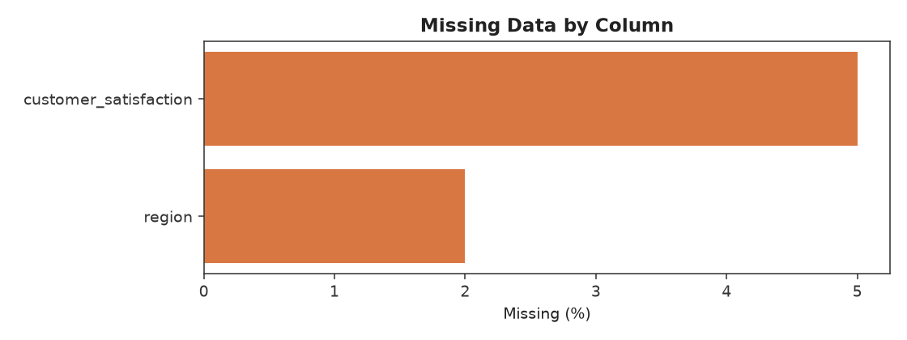
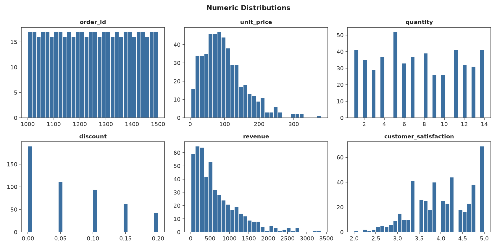
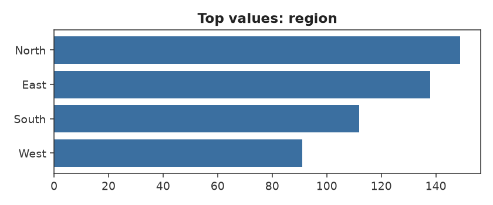
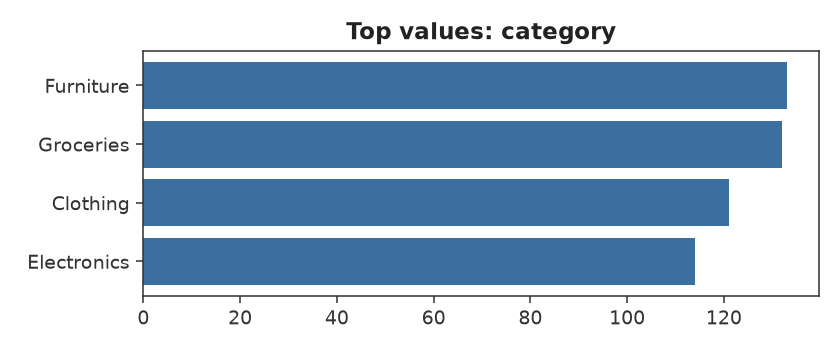
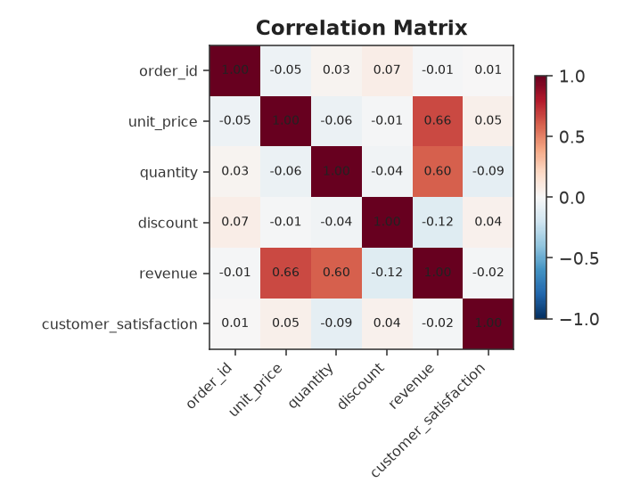
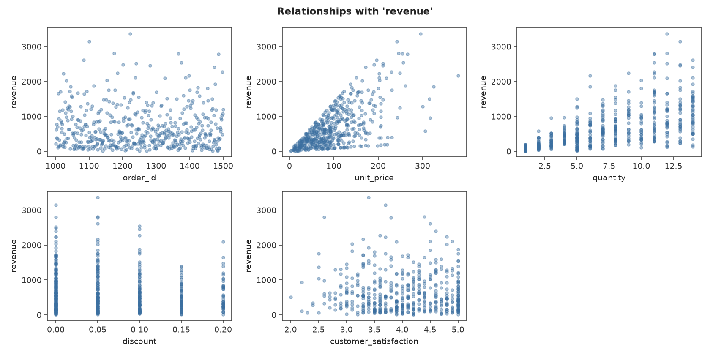

# Data Analysis Report: sample_sales.csv

## Overview

- Rows: **500**
- Columns: **9**
- Memory usage: **0.109 MB**
- Duplicate rows: **0**
- Missing cells: **35** (0.78% of all cells)

## Missing Data

|                       |   missing_count |   missing_pct |
|:----------------------|----------------:|--------------:|
| customer_satisfaction |              25 |             5 |
| region                |              10 |             2 |

## Numeric Columns

|                       |   count |     mean |     std |     min |      25% |      50% |     75% |     max |   skew |   missing |   outliers_iqr |
|:----------------------|--------:|---------:|--------:|--------:|---------:|---------:|--------:|--------:|-------:|----------:|---------------:|
| order_id              |     500 | 1250.5   | 144.482 | 1001    | 1125.75  | 1250.5   | 1375.25 | 1500    |  0     |         0 |              0 |
| unit_price            |     500 |   98.686 |  61.209 |    2.58 |   54.68  |   88.525 |  129.54 |  379.66 |  1.093 |         0 |             16 |
| quantity              |     500 |    7.362 |   4.074 |    1    |    4     |    7     |   11    |   14    |  0.083 |         0 |              0 |
| discount              |     500 |    0.066 |   0.066 |    0    |    0     |    0.05  |    0.1  |    0.2  |  0.635 |         0 |              0 |
| revenue               |     500 |  667.033 | 583.808 |    9.56 |  236.578 |  501.725 |  933.56 | 3367.52 |  1.499 |         0 |             20 |
| customer_satisfaction |     475 |    4     |   0.697 |    2    |    3.5   |    4     |    4.6  |    5    | -0.282 |        25 |              0 |

## Categorical Columns

**region** — 4 unique values, 10 missing
  Top values: North (149), East (138), South (112), West (91)

**category** — 4 unique values, 0 missing
  Top values: Furniture (133), Groceries (132), Clothing (121), Electronics (114)

## Correlations

Strongest pairwise correlations:

- unit_price ↔ revenue: **+0.664**
- quantity ↔ revenue: **+0.597**
- discount ↔ revenue: **-0.124**
- quantity ↔ customer_satisfaction: **-0.091**
- order_id ↔ discount: **+0.069**
- unit_price ↔ quantity: **-0.059**
- unit_price ↔ customer_satisfaction: **+0.054**
- order_id ↔ unit_price: **-0.047**

## Relationships with target: `revenue`

